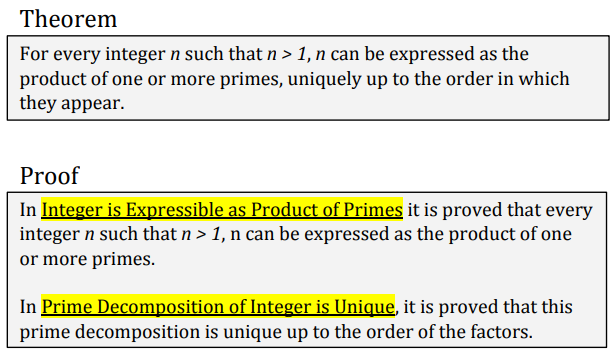
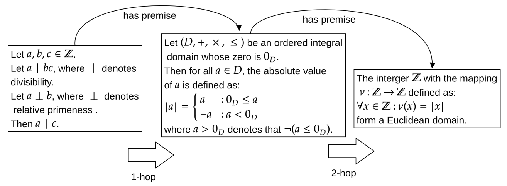

TextGraphs-16 Shared Task on Natural Language Premise Selection
=========================================================================

We invite participation in the 1st Shared Task on Natural Language Premise Selection associated with the 16th Workshop on Graph-Based Natural Language Processing (TextGraphs 2022).

All systems participating in the shared task will be invited to submit system description papers. Each system description paper will be presented as a poster at the main workshop: https://sites.google.com/view/textgraphs2022/.

## Overview

The task proposed this year is the Natural Language Premise Selection (NLPS) ([Ferreira et al., 2020a](https://aclanthology.org/2020.lrec-1.266/)), inspired by the field of automated theorem proving. 

The task of NLPS takes as input a mathematical statement, written in natural language, and outputs a set of relevant sentences (premises) that could support an end-user finding a proof for that mathematical statement. The premises are composed of supporting definitions and propositions that can act as explanations for the proof process.

Formally, the NLPS task can be defined as follows: 

Given a new mathematical statement s, that requires a mathematical proof, and a collection (or a knowledge base) of premises P = {p1, p2,..., pNp}, with size Np, retrieve the premises in P that are most likely to be useful for proving s.

An example of premises supporting a given theorem is presented in the figure below:



The task can be particularly challenging for existing Information Retrieval systems since it requires the ability to process both natural language and mathematical text ([Ferreira et al., 2021](https://aclanthology.org/2021.eacl-main.282/), [Ferreira et al., 2022](https://aclanthology.org/2022.findings-acl.76/)). Moreover, as shown in the example below, the retrieval of certain premises necessitates complex multi-hop inference ([Ferreira et al., 2020b](https://aclanthology.org/2020.acl-main.657/)):



## Important Dates

* 2022-06-30: Training and development data release
* 2022-07-15: Test data release; Evaluation start
* 2022-08-27: Evaluation end
* 2022-08-29: System description paper deadline
* 2022-09-02: Author notifications
* 2022-09-11: Camera-ready description paper deadline
* 2022-10-16: [TextGraphs-16 workshop](https://sites.google.com/view/textgraphs2022/)

Dates are specified in the ISO&nbsp;8601 format.

## Data

The shared task is based on the PS-ProofWiki (Premise Selection-ProofWiki) dataset ([Ferreira et al., 2020a](https://aclanthology.org/2020.lrec-1.266/)), which adopts as a basis the human-curated website [ProofWiki](https://proofwiki.org/wiki/Main_Page). 

PS-ProofWiki can be used for evaluating semantic representations for mathematical discourse ([Ferreira et al., 2022](https://aclanthology.org/2022.findings-acl.76/)), embeddings ([Ferreira et al., 2021](https://aclanthology.org/2021.eacl-main.282/)), textual entailment for mathematics, and natural language inference in the context of mathematical texts ([Ferreira et al., 2020b](https://aclanthology.org/2020.acl-main.657/)). In this shared task, we adopt this resource for Natural Language Premise Selection in an Information Retrieval setting.

The dataset is composed of training (5,519 instances), development (2,778 instances), and test set (2,763 instances), each including a list of mathematical statements and their relevant premises. The knowledge base supporting these statements contains approximately 16,205 premises. 

The goal of the shared task is to retrieve the set of relevant premises for a given statement in the test set by ranking the sentences contained in the supporting knowledge base.

**The practice data for the shared task is now available!**

**The test set for the shared task (with masked premises) is now available!**

1 - The knowledge base including the premises:

```shell
./data/knowledge_base.json
```

2 - Training set:

```shell
./data/train_set.json
```

3 - Development set:

```shell
./data/dev_set.json
```

3 - Test set (masked premises):

```shell
./data/test_set.json
```

Please, refer to the original dataset paper ([Ferreira et al., 2020a](https://aclanthology.org/2020.lrec-1.266/)) for additional details.

## Evaluation

The systems will be evaluated using Mean Average Precision (MAP) at K, with K = 500. This means that the top 500 premises retrieved from the knowledge base for supporting a given statement will be considered for the evaluation.

## Baselines

The shared task data distribution includes a baseline that uses a term frequency model (tf.idf) to rank how likely sentences in the knowledge base are to be a part of the set of premises for a given mathematical statement. The performance of this baseline on the development partition is 12.39 MAP@500.

### Python

To run the baseline on the development set:

```shell
./baseline_tfidf.py data/knowledge_base.json data/dev_set.json > predict.txt
```

The format of the `predict.txt` file is `statementID<TAB>premiseID` without header; the order is important. When [tqdm](https://github.com/tqdm/tqdm) is installed, `baseline_tfidf.py` will show a nicely-looking progress bar.

To compute the MAP@500 for the baseline, run the following command:

```shell
./evaluate.py --gold data/dev_set.json predict.txt
```

## Submission

In order to prepare a submission file for CodaLab, create a ZIP file containing your `predict.txt`.

To allow for a correct computation of the MAP score, the file `predict.txt` should contain at least 500 `premiseID` for each `statementID`

Please submit your solutions via CodaLab: <https://codalab.lisn.upsaclay.fr/competitions/5692>.

## Contacts

This shared task is organized within the 16th workshop on graph-based natural language processing, TextGraphs-16: <https://sites.google.com/view/textgraphs2022/>.

We welcome questions and answers on the shared task on CodaLab Forums: <https://codalab.lisn.upsaclay.fr/forums/5692>.

To contact the task organizers directly, please send an email to [textgraphsoc@gmail.com](mailto:textgraphsoc@gmail.com).

## Terms and Conditions

By submitting results to this competition, you consent to the public release of your scores at the TextGraph-15 workshop and in the associated proceedings, at the task organizers' discretion. Scores may include, but are not limited to, automatic and manual quantitative judgements, qualitative judgements, and such other metrics as the task organizers see fit. You accept that the ultimate decision of metric choice and score value is that of the task organizers.

You further agree that the task organizers are under no obligation to release scores and that scores may be withheld if it is the task organizers' judgement that the submission was incomplete, erroneous, deceptive, or violated the letter or spirit of the competition's rules. Inclusion of a submission's scores is not an endorsement of a team or individual's submission, system, or science.

You further agree that your system may be named according to the team name provided at the time of submission, or to a suitable shorthand as determined by the task organizers.

You agree not to use or redistribute the shared task data except in the manner prescribed by its licence.

**To encourage transparency and replicability, all teams must publish their code, tuning procedures, and instructions for running their models with their submission of shared task papers.**

## References

If you take part to the shared task please consider citing:

```
@inproceedings{tgsharedtask:22,
  title     = "TextGraphs~2022 Shared Task on Natural Language Premise Selection",
  author    = "Valentino, Marco and Ferreira, Deborah and Thayaparan, Mokanarangan and Freitas, Andr{\'e} and Ustalov, Dmitry",
  year      = "2022",
  booktitle = "Proceedings of the Sixteenth Workshop on Graph-Based Methods for Natural Language Processing (TextGraphs-16)",
  publisher = "Association for Computational Linguistics",
  language  = "English",
}
```

The original PS-ProofWiki dataset adopted for the shared task is described in the following paper:


```
@inproceedings{ferreira-freitas-2020-natural,
    title = "Natural Language Premise Selection: Finding Supporting Statements for Mathematical Text",
    author = "Ferreira, Deborah and Freitas, Andr{\'e}",
    booktitle = "Proceedings of the 12th Language Resources and Evaluation Conference",
    month = may,
    year = "2020",
    address = "Marseille, France",
    publisher = "European Language Resources Association",
    url = "https://aclanthology.org/2020.lrec-1.266",
    pages = "2175--2182",
    language = "English",
    ISBN = "979-10-95546-34-4",
}
```
